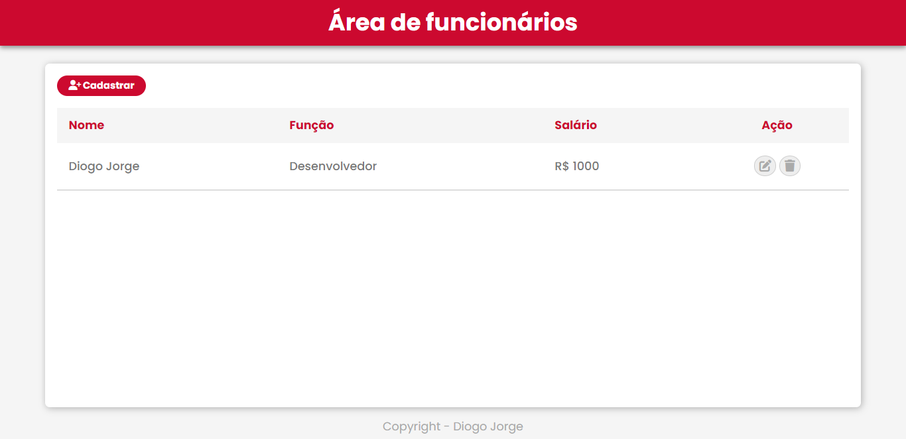

<h1 align="center">CRUD - Diogo Jorge</h1>

<h1 align="center">
    <a href="https://diogofernandoj.github.io/crud" target="_blank">
        
        <small align="center">Clique para visitar o projeto🔗</small>
    </a>
</h1>

## 📕 Sobre

Um dos meus primeiros projetos Javascript, nele você pode cadastrar funcionários utlizando os parametros Nome, Função e Salário. O cadastro será exibido na tabela e você pode gerencia-los (editar ou deletar).

## ⚙ Ferramentas utilizadas

Para este projeto utilizei as seguintes tecnologias:

- HTML5
- CSS3
- Javascript